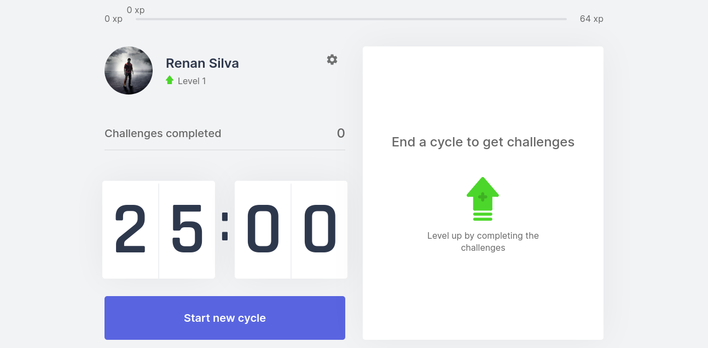

# xmov

## Introduction

This is a Next.js web app project based on [Pomodoro Technique](https://en.wikipedia.org/wiki/Pomodoro_Technique). When you hit the "Start new cycle" button a timer will start a countdown from 25 min. In the meantime, you can fully focus on your task. When the time reaches 0, it will give you a challenge, the type of the challenge can be for body or eyes. You'll get XP and level up as you complete the challenges.

This project was created following a [Rocketseat](https://rocketseat.com.br/) course, but some extra features were added.

### New features

- Responsive design
- Translation (EN and PT)
- Menu with some options
- Login using OAuth Google
- Logout
- README

### App UI



## Demo

- https://xmov.vercel.app/
- If you want to check how the level up works check this version (countdown 5s) https://xmov-renantkn.vercel.app/

## Project

This is a [Next.js](https://nextjs.org/) project bootstrapped with [`create-next-app`](https://github.com/vercel/next.js/tree/canary/packages/create-next-app).

### Getting Started

First, run the development server:

```bash
npm run dev
# or
yarn dev
```

Open [http://localhost:3000](http://localhost:3000) with your browser to see the result.

## Issues

- The progress of the user is saved on cookies, which means, if you login into another browser or computer, your level will return to 0. Or if someone else logs in in your browser you'll share the same level.

- You need to log out to change the language since it's only on the login menu.

- There's no option to change the countdown value, I keep it 25 min because it's recommended.

- Fix a unexpected error on some mobile deviced
